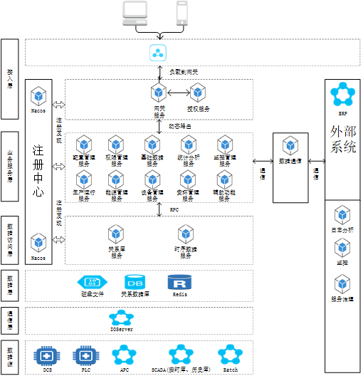

HOLLiAS iODS智能生产远程监控系统
====================================================
项目全称为：HOLLiAS iODS智能生产远程监控系统

# 概述
新的智能工厂软件一体化平台，系统满足一体化认证、一体化操作、一体化运维的要求。

# 系统架构


# 技术选型
 * Springboot 2.1.9.RELEASE
 * SpringCloud Greenwich.RELEASE
 * SpringCloud-Alibaba 2.1.0.RELEASE
 
# 异常状态码规则
异常类型主要分两种：系统内部异常和 API 接口（业务请求）异常，
对应的异常类为： `ApiException` 和 `InternalException`
本系统的异常码，统一由 `ErrorType` 子类进行区分，code 定义规则如下示例说明。

示例状态码为 ： `00000001`
    
    前四位业务类型  |   状态错误码
    
    1000          |      0001

对应的类为： 

    SystemErrorType         ：   系统错误状态码
    AuthErrorType           ：   权限管理错误状态码

业务类型定义为：

    1000    |   系统通用
    2000    |   网关服务
    3000    |   权限管理服务
    
 # URL 格式约定
 
 |     服务       |          URL 格式                  |
 | --------------| ---------------------------------- |
 |   权限管理服务   |  http://{ip}[:port]/auth/{xxx}   |

# 其他说明
 * 首次请将根pom中的modules中模块注释然后 mvn install到本地仓库。
 * Linux如果项目遇到无法启动的情况，需要添加参数 ： -Djava.security.egd=file:/dev/urandom
 
# 项目结构
```
├─app-server                        |   应用服务子系统程序
│  └─sm-server                      |   系统设置服务
├─auth                              |   授权
│  ├─auth-api                       |   权限管理服务暴露接口
│  └─auth-server                    |   权限管理服务
├─common                            |   通用类库
│  ├─core                           |   核心类库，定义错误异常、返回结果
│  └─web                            |   WEB相关的类库，定义基本控制器、通用全局异常处理、查询参数
├─data                              |   数据层服务
│  ├─auth-data-api                  |   权限数据服务暴露接口
│  └─auth-data-server               |   权限数据服务实现
├─doc                               |   数据库设计、SQL脚本、Nacos配置导出等文档
├─gateway                           |   网关服务
├─rpc-proxy                         |   RPC代理
│  ├─rpc-proxy-api                  |   RPC代理服务暴露接口
│  └─rpc-proxy-server               |   RPC代理服务实现
```
# 项目依赖关系
| 类库 | 内部依赖 | 说明 |
| --- | --- | ---- |
| common-core | 无 | 系统核心包，定义系统异常、错误码 |
| auth-data-api | common-core | 权限管理数据库服务暴露接口 |
| auth-api | common-core | 权限管理服务暴露接口，判断权限、Token |
| rpc-proxy-api   | 无 | RPC代理服务暴露接口 |
| common-web | common-core、auth-api | WEB相关的类库，定义基本控制器、拦截器、通用全局异常处理、查询参数 |
| auth-data-server | common-web、auth-data-api | 权限管理数据库服务 |
| auth-server | common-web、auth-data-api | 权限管理服务 |
| sm-server | common-web、auth-data-api | 系统设置服务 |
| gateway | common-core、auth-api | 网关服务 |
| rpc-proxy-server | common-core、auth-data-api、rpc-proxy-api | RPC代理服务 |